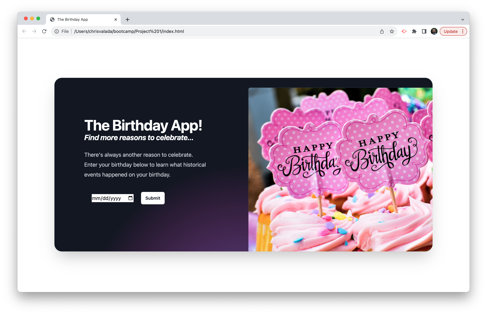
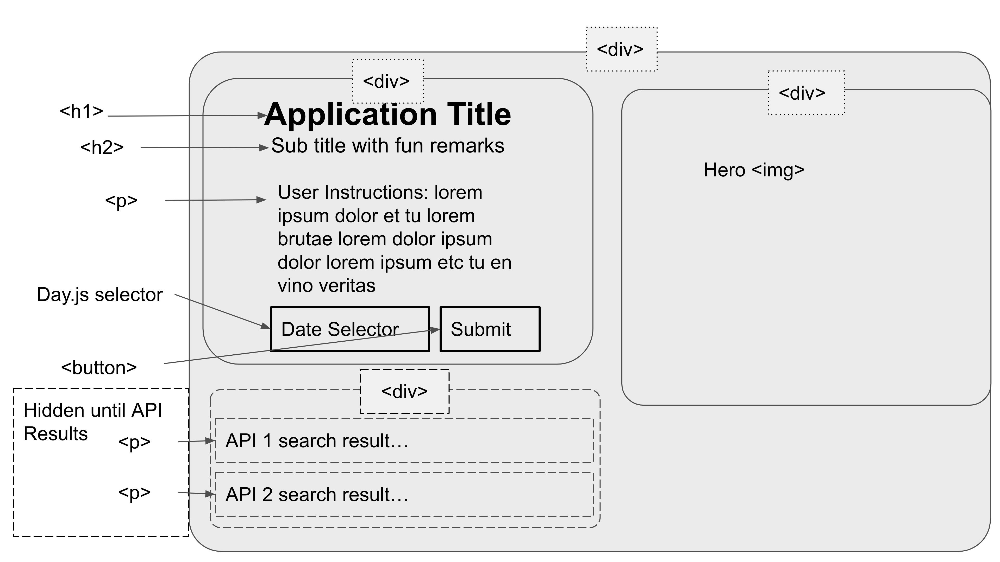

# The Birthday App

The Birthday App is a web app where users input their birthday to learn what historical events happened on their birthday and what the Billboard Top Songs were for the week they were born.

The Birthday App utilizes HTML, CSS, Tailwind, Javascript, Day.js, local browser storage, and 3rd party APIs.

The Birthday App can be found at the following URL: https://lindseycarlson23.github.io/birthday-app/



## User Story

```
AS A person with no milestone birthdays in the near future
I WANT I want to learn some fun facts about my birthday including the Billboard Top songs and other historical events from the day of my birth
SO THAT I can include them in my birthday celebration.
```

## Acceptance Criteria

```
GIVEN a website with date selector
WHEN I enter my birthdate
THEN I am presented with a list of historical events that occurred on my birthday.
WHEN I view the list of historical events.
THEN I am also presented with a list of the Billboard Top Songs from the week of my birth.
WHEN I enter a different date on the date selector
THEN I see results for that new date
```
## Wireframe



## APIs Used

Historical Events API - API Ninjas https://api-ninjas.com/api/historicalevents

Billboard Music API https://rapidapi.com/DevoCat/api/billboard-api5

## Future Development

User Experience - Return additional birthdate-related information such as celebrity birthdays, Top 5 songs with links to YouTube or Spotify Music, obscure holidays, and more historical events.

User Acquisition - Add feature for users to share their results to FaceBook which will encourage his or her friends to also use the app.

Monetization - Create space for advertising or affiliate links to birthday-related products.


## Collaborators

Christopher Bartlett https://github.com/cbbartlett

Lindsey Carlson https://github.com/lindseycarlson23

Robert Mancuso https://github.com/bmancuso3

Chris Valada https://github.com/clvalada

## License

MIT

## Photo Credit
Photo by <a href="https://unsplash.com/@fochrist1?utm_content=creditCopyText&utm_medium=referral&utm_source=unsplash">Robert Anderson</a> on <a href="https://unsplash.com/photos/-gDHgEcec6Q?utm_content=creditCopyText&utm_medium=referral&utm_source=unsplash">Unsplash</a>
  